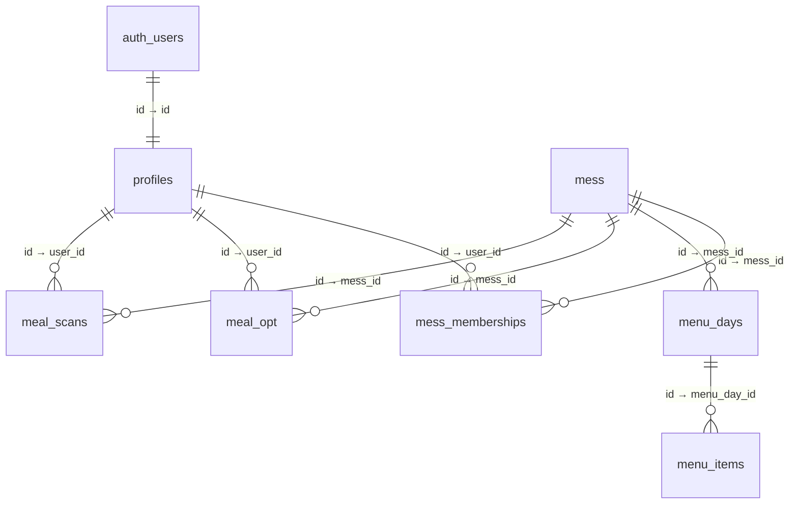

# 🍴 The Food Forge — Walkthrough

A complete feature-by-feature guide to the Mess Management System.

---

## 1. Landing Page (`/`)

The home page introduces **The Food Forge** with:

- **Hero section** — Tagline, CTA buttons ("Start Free Trial", "View Demo"), trust indicators (10K+ meals, 98% accuracy, 4.8 rating)
- **Feature cards** — QR Attendance, Digital Menu, Automated Billing, Role-based Access
- **Mobile preview** — A phone mockup showing the student experience (current meal, QR code)
- **CTA banner** — "Ready to join The Food Forge?" with signup button
- **Footer** — Branding and quick links

---

## 2. Student Login / Signup (`/login`)

Students authenticate via **Supabase Auth**:

- **Sign Up** — Enter full name, email, and password → Creates an `auth.users` entry + `profiles` row (via SQL trigger)
- **Sign In** — Email + password login → Redirects to student dashboard
- No email verification required (configurable in Supabase dashboard)

---

## 3. Student Dashboard (`/student`)

After login, students see their personal dashboard:

- **Personal QR Code** — Unique QR generated from the student's user ID, shown to mess staff at the counter
- **Attendance History** — Records of meals scanned (breakfast, lunch, dinner)
- **Current Meal Status** — Which meal is currently active based on time of day

---

## 4. Admin Panel (`/admin`)

### How to Login

Navigate to `http://localhost:3000/admin` and enter:

| Field | Value |
|---|---|
| Username | `admin1` |
| Password | `admin1` |

### Dashboard Tab

The default view after login shows:

- **Stats Grid** — Total students, today's breakfast / lunch / dinner counts
- **Recent Scans** — Last 5 QR scans with student name, time, and meal type
- **Quick Scan** — Button to open the QR scanner
- **Add Student** — Quick shortcut to register a new student

### Students Tab

Lists all registered students with:

- Name and avatar initial
- Join date
- Active status badge
- "Add Student" button in header

#### Adding a Student

Click **Add Student** → Fill in full name, email, password → Click **Add Student**. The student is created in Supabase Auth with an auto-confirmed email and appears in the list in real-time.

### Attendance Tab

Shows today's full attendance log:

- Meal-type badges (Breakfast / Lunch / Dinner) with counts
- Each scan entry shows student name, timestamp, and meal type
- Data updates in **real-time** via Supabase Realtime subscriptions

### QR Scanning

Click the scan button (📷) → Camera opens → Point at a student's QR code → Attendance is recorded automatically:

- Meal is determined by time: **6–10 AM** = Breakfast, **11 AM–3 PM** = Lunch, rest = Dinner
- Duplicate scans are blocked (unique constraint per student per meal per day)
- Success/error toast appears at the top

---

## 5. Admin User Management API (Backend)

The FastAPI backend at `http://localhost:8000` provides admin-level user management:

| Action | Method | Endpoint |
|---|---|---|
| List all users | `GET` | `/api/admin/users` |
| Create a user | `POST` | `/api/admin/users` |
| Reset password | `PUT` | `/api/admin/users/password` |
| Update profile | `PUT` | `/api/admin/users/profile` |
| Delete user | `DELETE` | `/api/admin/users` |

> 💡 Interactive API docs available at [http://localhost:8000/docs](http://localhost:8000/docs)

These endpoints use the **Supabase service role key** to perform admin-privileged operations (password resets, user deletion, etc.).

---

## 6. Database Schema

All data lives in **Supabase PostgreSQL**. The schema is defined in `COPY_TO_SUPABASE_SQL.sql`:



### Tables

| Table | Key Columns | Purpose |
|---|---|---|
| `profiles` | id, full_name, phone, role | User profiles linked to auth |
| `mess` | id, name, hostel | Mess/canteen info |
| `mess_memberships` | mess_id, user_id, diet, room | Student ↔ mess link |
| `menu_days` | mess_id, menu_date | Daily menu schedule |
| `menu_items` | menu_day_id, meal, item_name | Individual items |
| `meal_opt` | user_id, opt_date, meal, is_opted | Opt-in/out records |
| `meal_scans` | user_id, scan_date, meal | Attendance records |

### Row Level Security (RLS)

- All tables have RLS enabled
- Profiles: public read, self-insert only
- Meal scans & opt-ins: authenticated users can CRUD
- Other tables: public read access

---

## 7. Real-time Features

The app uses **Supabase Realtime** channels to push live updates:

- **New student registration** → Automatically appears in the admin student list
- **New QR scan** → Today's attendance table and stats update instantly
- No manual refresh needed

---

## 8. Quick Reference: Running the App

```bash
# Terminal 1 — Backend
cd backend
pip install -r requirements.txt
python -m uvicorn app.main:app --reload --port 8000

# Terminal 2 — Frontend
cd frontend
npm install
npm run dev
```

Then open **http://localhost:3000** in your browser.

---

## 9. Key Files Reference

| File | What It Does |
|---|---|
| `frontend/app/page.tsx` | Landing page with hero, features, CTA |
| `frontend/app/admin/page.tsx` | Full admin dashboard (login + tabs) |
| `frontend/app/login/page.tsx` | Student auth form |
| `frontend/app/student/page.tsx` | Student QR + attendance view |
| `frontend/components/QRScanner.tsx` | Camera QR scanner component |
| `frontend/lib/supabase.ts` | Supabase client initialization |
| `backend/app/main.py` | FastAPI entry point, CORS, routers |
| `backend/app/routes/admin.py` | User management API (CRUD + password reset) |
| `COPY_TO_SUPABASE_SQL.sql` | Complete database schema |

---

**Built with ❤️ by The Food Forge Team**
